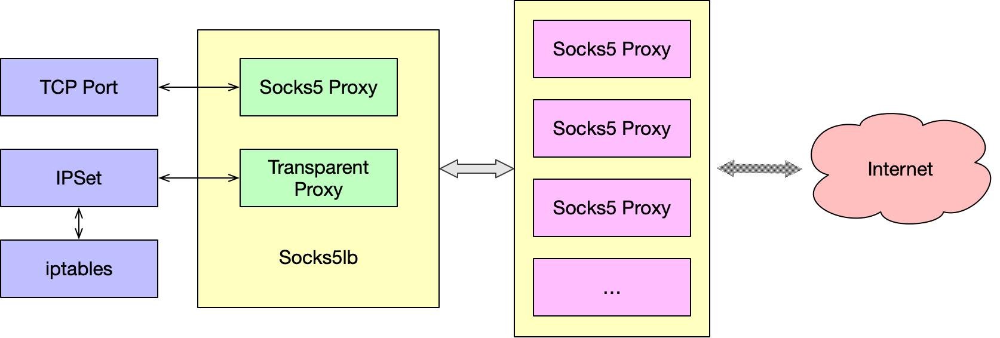

# socks5lb 非常简单的 Socks5 Proxy 负载均衡

## 更新记录

- `20220706` 完成针对 Linux 的透明网关功能
- `20220620` 完成基本功能



我们在科学使用网络的时候经常会碰到 Socks5 Proxy 无法联通的情况，这有可能是因为网络或者线路的调整和波动，这时候往往需要我们自己手工的切换节点，非常的麻烦而且会中断网络请求。

这个工具就是为了解决上述问题而编写的，它简单的说就是个针对 Socks5 Proxy 的前置负载均衡，能够提供经过检验的稳定可靠的 Socks Proxy 节点，如果是针对 Linux 系统下同时能够提供透明代理以及针对 Socks5
协议的转换，而且方便搭配 ipset 以及 iptables 使用。

目前实现的部分特性有：

- 能够提供 Socks5 Proxy 的负载均衡（轮询机制）同时提供健康检查；
- 针对 Linux 提供[透明代理](https://www.kernel.org/doc/Documentation/networking/tproxy.txt)以及 Socks5 的协议转换；
- 使用 Golang 编写部署和配置方便。

## 编译

建议使用 docker-compose 编译生成镜像文件，直接执行 docker-compose build 即可。

## 配置

首先是针对 socks5lb 的基本配置，例如以下的配置配置了三个 Socks5 Proxy 同时暴露到本地的 1080 端口，针对 Linux 的透明代理暴露在 8848 端口。

```yaml
socks5_listen: ":1080"
tproxy_listen: ":8848"
backends:
  - addr: 192.168.100.254:1086
    check_config:
      check_url: https://www.google.com/robots.txt
      initial_alive: true
      timeout: 3
  - addr: 10.1.0.254:1086
    check_config:
      check_url: https://www.google.com/robots.txt
      initial_alive: false
      timeout: 30
  - addr: 172.16.100.254:1086
    check_config:
      check_url: https://www.google.com/robots.txt
      initial_alive: true
      timeout: 3
```

### 部署

首先，以下是 docker-compose 相关的配置，建议使用 `network_mode: 'host'` 方式，防止 DOCK 的 iptables 造成网络联通错误

```yaml
version: "3"
services:
  socks5lb:
    image: ghcr.io/mingcheng/socks5lb
    restart: always
    dns:
      - 8.8.8.8
      - 8.8.4.4
    environment:
      TZ: "Asia/Shanghai"
      CHECK_TIME_INTERVAL: 3600
    network_mode: "host"
    privileged: true
    volumes:
      - ./socks5lb.yml:/etc/socks5lb.yml:ro
```

然后配置（供参考）iptable 参数，将所有的流量都通过 8848 代理端口转发（注意 redrock 链没有定义，请自行配置）。

```shell
iptables -t nat -I PREROUTING -p tcp -m set --match-set redrock dst -j REDIRECT --to-ports 8848
iptables -t nat -I OUTPUT -p tcp -m set --match-set redrock dst -j REDIRECT --to-ports 8848
```

## 常见问题

### 在其他非 Linux 系统下可以使用 tproxy_listen 这个配置吗？

不好意思，透明代理只针对 Linux 平台。

### 有没有类似功能的项目？

- https://github.com/ginuerzh/gost
- https://github.com/nadoo/glider
